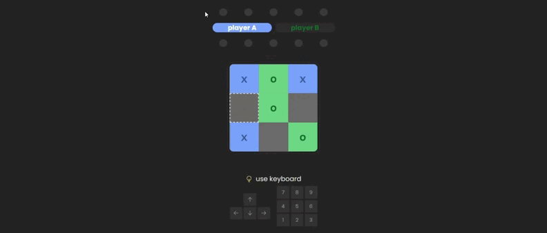

# Tic Tac Toe

> This project was created solely and exclusively to practice and develop basic knowledge of the web. [demo](https://tictactoe-dangelomedinag.vercel.app).

## Classic Game

Play the classic Tic-Tac-Toe game (also called Noughts and Crosses) for free with one or two players.

made by [svelte❤️](https://kit.svelte.dev) / [sveltekit⚡](https://svelte.dev) and powered by [vite](https://kit.svelte.dev)
